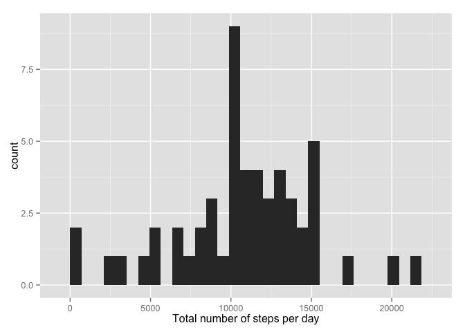
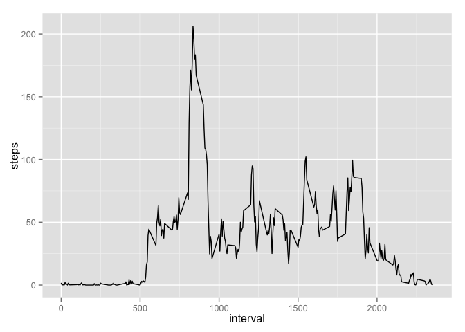
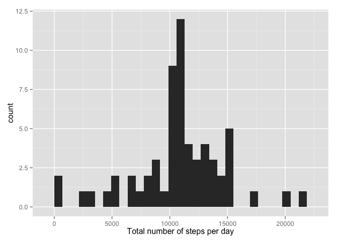
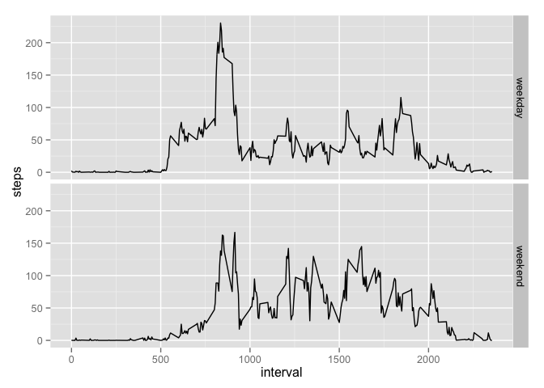

# Reproducible Research: Peer Assessment 1


## Loading and preprocessing the data

### *Load the data (i.e. read.csv())*
* Load necessary packages  
* Load data 

```r
### First: load necessary packages
library(ggplot2)
### load: data
data <- read.csv("activity.csv")
```


## What is mean total number of steps taken per day?

### *Make a histogram of the total number of steps taken each day*
* The sum of the steps are calculated for each day, and a new dataframe is created  
* The histogram is plotted


```r
### Create dataframe that includes the sum of steps for each date

sumsteps <- aggregate(steps~date,data=data, sum)

### Plot histogram of sum of steps
qplot(sumsteps$steps, xlab="Total number of steps per day")
```

```
## stat_bin: binwidth defaulted to range/30. Use 'binwidth = x' to adjust this.
```

 

### *Calculate and report the mean and median total number of steps taken per day*

```r
##calculate mean and median of sum of steps for each day
Mean <- mean(sumsteps$steps)
Median <- median(sumsteps$steps)
```
* 1.0766 &times; 10<sup>4</sup> is the mean of the sums of steps for each day  
* 10765 is the median of the sums of step for each day

## What is the average daily activity pattern?

### *Make a time series plot (i.e. type = "l") of the 5-minute interval (x-axis) and the average number of steps taken, averaged across all days (y-axis)*
* Create a new dataframe with the mean number of steps for each interval
* Create a linegraph of the mean number of steps on the ordinate and the time interval on the abscissa


```r
avsteps<-aggregate(steps~interval, data=data, mean)
ggplot(data=avsteps, aes(x=interval, y=steps), xlab="Time interval", ylab="Mean number of steps") + geom_line(aes(group=1))
```

 

### *Which 5-minute interval, on average across all the days in the dataset, contains the maximum number of steps?*

* Identify the interval with the highest mean number of steps using the which.max function and print the corresponding row of the dataframe

```r
avsteps[which.max(avsteps$steps),]
```

```
##     interval steps
## 104      835 206.2
```


## Imputing missing values
### *Calculate and report the total number of missing values in the dataset (i.e. the total number of rows with NAs)*

* Calculate the number of rows with NAs

```r
## create a logical vector, corresponding to the rows with NAs
has.na <- apply(data, 1, function(x){any(is.na(x))})
## calculate the sum of true values of this vector(rows that has NAs)
sum(has.na)
```

```
## [1] 2304
```
### *Devise a strategy for filling in all of the missing values in the dataset. The strategy does not need to be sophisticated. For example, you could use the mean/median for that day, or the mean for that 5-minute interval, etc.*
* Impute NAs with the average number of steps for that time interval  
    + First: create a named vector with the average number of steps for each interval  
    + Second: With a for loop go through all NAs and substitute with a corresponding value for that interval and put the data in a new dataframe called data2  


```r
## calculate average by interval and put the values in a named vector
avvalues <- sapply(split(data, data$interval), function(x) mean(x[,1],na.rm=T))
## With a for loop, go through all nas, and substitute by corresponding mean value for interval
data2<-data
for (i in 1:nrow(data2)){
  if (is.na(data2$steps[i])){
    intname <- as.character(data2$interval[i])
    impval<-avvalues[intname]
    data2$steps[i] <-impval
     }
  }
```
### *Create a new dataset that is equal to the original dataset but with the missing data filled in.*

```r
### Check for complete cases in dataframes data and data2
sum(complete.cases(data))
```

```
## [1] 15264
```

```r
sum(complete.cases(data2))
```

```
## [1] 17568
```

###  *Make a histogram of the total number of steps taken each day and Calculate and report the mean and median total number of steps taken per day. Do these values differ from the estimates from the first part of the assignment? What is the impact of imputing missing data on the estimates of the total daily number of steps?*


```r
## make new aggregated dataframe, create new histogram and calculate mean and median

sumsteps2 <- aggregate(steps~date,data=data2, sum)
qplot(sumsteps2$steps, xlab="Total number of steps per day")
```

```
## stat_bin: binwidth defaulted to range/30. Use 'binwidth = x' to adjust this.
```

 

```r
mean(sumsteps2$steps)
```

```
## [1] 10766
```

```r
median(sumsteps2$steps)
```

```
## [1] 10766
```

The impact of imputing missing data on the estimates of the total daily number of steps is very small, probably due to the method of imputation.

## Are there differences in activity patterns between weekdays and weekends?

### *Create a new factor variable in the dataset with two levels – “weekday” and “weekend” indicating whether a given date is a weekday or weekend day.*


```r
### create a new factor variable of the dates
data2$wd <- factor(weekdays(as.Date(data2$date)))
### recode into two levels
levels(data2$wd) <- c("weekday","weekday","weekend","weekend","weekday","weekday","weekday")
```

### *Make a panel plot containing a time series plot (i.e. type = "l") of the 5-minute interval (x-axis) and the average number of steps taken, averaged across all weekday days or weekend days (y-axis).*


```r
## aggregate data keeping the wekkday and the interval variable
stepav2 <- aggregate(steps~interval+wd,data=data2, mean)
## Using ggplot2, make linegraphs in two panes corresponding to weekday/weekend days

ggplot(data=stepav2, aes(x=interval, y=steps)) + geom_line(aes(group=1))+facet_grid(wd~.)
```

 

The difference in activity pattern is that on weekdays the activity seems to start  and stop earlier. There is also a dip in the activity in the middle of the day.
